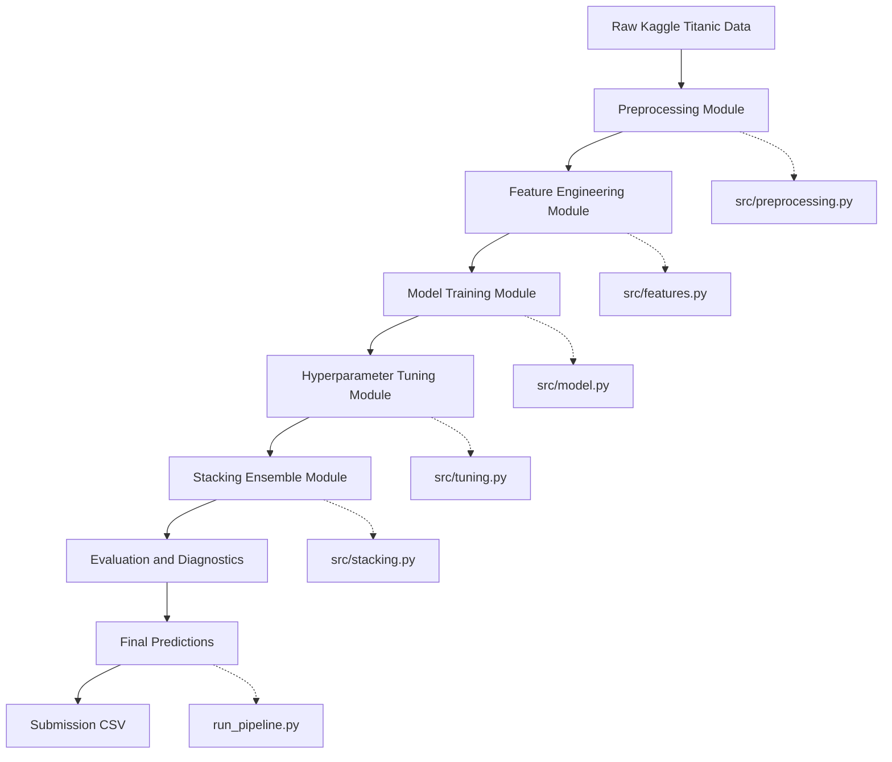
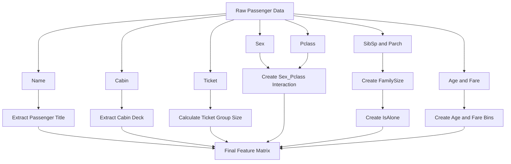
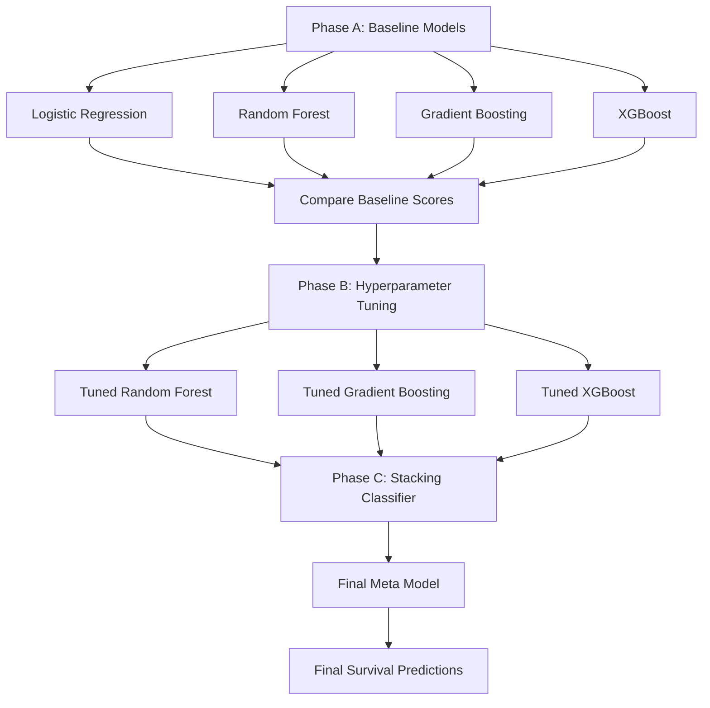
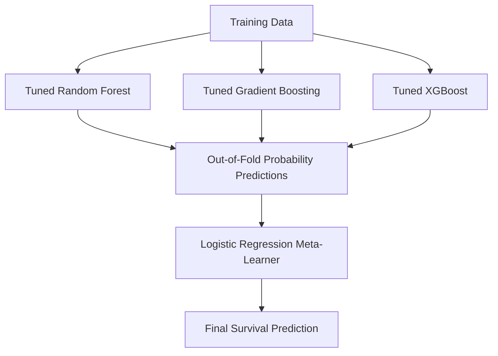
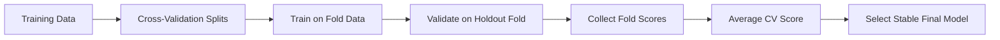

# 🚢 Titanic Machine Learning Pipeline

A production-style machine learning project built for the Kaggle Titanic competition.

This project started as a basic Jupyter Notebook experiment and was refactored into a clean, modular Python machine learning pipeline. The final solution uses advanced feature engineering, model tuning, and a Stacking Classifier to improve prediction accuracy and create a reproducible end-to-end workflow.


---

## 1. Project Overview

The objective of this project is to predict whether a passenger survived the Titanic disaster using structured passenger data.

This is a **supervised machine learning binary classification project**.

The model learns from historical passenger records where the survival outcome is already known, then uses those learned patterns to predict survival for unseen passengers.

The target column is:

```text
Survived
```

Where:

```text
0 = Did not survive
1 = Survived
```

This project belongs to the following machine learning category:

```text
Artificial Intelligence
└── Machine Learning
    └── Supervised Learning
        └── Classification
            └── Binary Classification
                └── Tabular Data Prediction
```

---

## 2. Executive Summary

The project was designed to move beyond a simple notebook-based baseline and create a stronger, cleaner, and more professional machine learning workflow.

The original baseline achieved approximately **81% accuracy**.  
Through advanced feature engineering, hyperparameter tuning, and model stacking, the final solution achieved an out-of-fold cross-validation accuracy of approximately **83.61%**.

The final model is a **Stacking Classifier** that combines the strengths of multiple tuned tree-based models and uses a Logistic Regression meta-learner to make the final prediction.

---

## 3. Key Results

| Metric / Result | Value |
|---|---:|
| Original Baseline Accuracy | ~81% |
| Best Individual Tuned CV Score | ~83.95% |
| Final Stacking OOF CV Accuracy | ~83.61% |
| Internal Diagnostic Accuracy | ~87% |
| ROC-AUC | 0.9277 |
| Survival Recall | ~76% |
| Survival Precision | ~90% |

These results show that the model improved significantly after introducing better features, stronger model selection, and ensemble learning.

---

## 4. Project Architecture

The project was refactored from a single notebook into a modular Python architecture.

```text
titanic-ml-pipeline/
│
├── data/
│   ├── train.csv
│   └── test.csv
│
├── notebooks/
│   └── 01_baseline.ipynb
│
├── src/
│   ├── preprocessing.py
│   ├── features.py
│   ├── model.py
│   ├── tuning.py
│   └── stacking.py
│
├── submissions/
│   └── submission.csv
│
├── run_pipeline.py
├── requirements.txt
└── README.md
```

---

## 5. System Architecture Diagram



---

## 6. Module Responsibilities

| File | Responsibility |
|---|---|
| `src/preprocessing.py` | Handles raw data loading, missing value imputation, categorical encoding, and preparation of clean datasets |
| `src/features.py` | Contains all advanced feature engineering logic |
| `src/model.py` | Defines models, training logic, and cross-validation wrappers |
| `src/tuning.py` | Handles hyperparameter tuning using search grids |
| `src/stacking.py` | Builds and manages the final stacking ensemble |
| `run_pipeline.py` | Executes the complete machine learning pipeline from raw data to final submission |

---

## 7. Full Pipeline Flow


---

## 8. Feature Engineering Strategy

Feature engineering was the biggest driver of performance improvement in this project.

Instead of relying only on the original Titanic dataset columns, the project extracts deeper passenger-level, family-level, ticket-level, and socio-demographic signals.

### Main Engineered Features

| Feature | Description |
|---|---|
| `CabinDeck` | Extracts the cabin deck letter from the `Cabin` column |
| `TicketGroupSize` | Counts how many passengers shared the same ticket |
| `Sex_Pclass` | Combines gender and passenger class into one interaction feature |
| `Title` | Extracts passenger title from name, such as `Mr`, `Mrs`, `Miss`, `Master`, or `Rare` |
| `FamilySize` | Combines `SibSp` and `Parch` to calculate total family size |
| `IsAlone` | Identifies passengers travelling alone |
| `FareBin` | Groups fare values into useful fare ranges |
| `AgeBin` | Groups ages into meaningful age categories |

---

## 9. Feature Engineering Diagram



---

## 10. Why the Features Matter

### Cabin Deck Extraction

The `Cabin` column contains many missing values, but when present, it provides useful context. Extracting the deck letter helps the model detect possible links between cabin location, passenger class, and survival chances.

### Ticket Group Size

Passengers sharing the same ticket were often travelling together. This feature helps identify hidden groups that may not be captured by surname or family size alone.

### Sex and Passenger Class Interaction

Survival on the Titanic was strongly affected by both gender and class. The `Sex_Pclass` feature helps the model understand that survival probability was influenced by the combination of these two variables, not just each variable separately.

### Title Extraction

Titles such as `Mr`, `Mrs`, `Miss`, and `Master` provide useful demographic signals. They help the model separate passengers into cleaner social and age-related groups.

### Family Size and IsAlone

Passengers travelling alone may have had different survival patterns compared to passengers travelling with family. These features help the model capture group-based survival behavior.

---

## 11. Modeling Strategy

The modeling process was completed in three main phases:

1. Baseline model training
2. Hyperparameter tuning
3. Meta-ensembling using a Stacking Classifier



---

## 12. Phase A: Baseline Models

The first modeling stage tested standard implementations of common classification algorithms.

The baseline models included:

- Logistic Regression
- Random Forest
- Gradient Boosting
- XGBoost

At this stage, XGBoost showed strong early performance and became one of the major models used in the final ensemble.

---

## 13. Phase B: Hyperparameter Tuning

The second stage focused on finding better model configurations.

Hyperparameter tuning was performed using `RandomizedSearchCV`.

The tuning process explored parameters such as:

- Number of estimators
- Tree depth
- Learning rate
- Subsampling ratio
- Regularization strength
- Split criteria
- Model complexity controls

The tuned Gradient Boosting and XGBoost models reached approximately **83.95% cross-validation accuracy** individually.

This stage helped reduce underfitting and overfitting while improving model stability.

---

## 14. Phase C: Stacking Classifier

The final model used a stacking ensemble.

A stacking model combines multiple base models and trains a second-level model to learn how to combine their predictions.

In this project:

- Level 0 models produced probability predictions
- Level 1 model learned how to combine those predictions
- Final output was the predicted survival class



### Stacking Design

| Level | Model Role |
|---|---|
| Level 0 | Tuned Random Forest |
| Level 0 | Tuned Gradient Boosting |
| Level 0 | Tuned XGBoost |
| Level 1 | Logistic Regression meta-learner |
| Output | Final survival prediction |

The meta-learner was trained on the probability outputs from the base models. This allowed the final model to learn when to trust one model more than another.

---

## 15. Evaluation Strategy

The project used cross-validation and diagnostic metrics to evaluate model performance and reduce the risk of overfitting.



### Evaluation Metrics

| Metric | Meaning |
|---|---|
| Accuracy | Measures the percentage of total correct predictions |
| Precision | Measures how many predicted survivors were actually survivors |
| Recall | Measures how many real survivors were correctly detected |
| ROC-AUC | Measures how well the model separates survivors from non-survivors |
| Cross-Validation Score | Measures how stable the model is across different data splits |

---

## 16. Final Model Diagnostics

The final Stacking Classifier showed strong predictive performance.

```text
Accuracy:              ~87% internal diagnostic accuracy
Survival Recall:       ~76%
Survival Precision:    ~90%
ROC-AUC:               0.9277
OOF CV Accuracy:       ~83.61%
```

The model achieved strong class separation and maintained a good balance between precision and recall.

This means the model was not only accurate overall, but also reliable in identifying actual survivors while avoiding too many false survival predictions.

---

## 17. How to Run the Project

### Step 1: Clone the Repository

```bash
git clone https://github.com/your-username/titanic-ml-pipeline.git
cd titanic-ml-pipeline
```

### Step 2: Create a Virtual Environment

```bash
python -m venv venv
```

Activate the virtual environment:

```bash
# Windows
venv\Scripts\activate
```

```bash
# macOS / Linux
source venv/bin/activate
```

### Step 3: Install Dependencies

```bash
pip install -r requirements.txt
```

### Step 4: Add Kaggle Data

Download the Titanic dataset from Kaggle and place the files inside the `data/` folder.

Expected files:

```text
data/train.csv
data/test.csv
```

### Step 5: Run the Full Pipeline

```bash
python run_pipeline.py
```

After running the pipeline, the final Kaggle submission file will be generated here:

```text
submissions/submission.csv
```

---

## 18. Expected Pipeline Output

```text
Loading raw datasets...
Preprocessing data...
Engineering features...
Training baseline models...
Running hyperparameter tuning...
Training stacking classifier...
Evaluating final model...
Generating predictions...
Submission file saved to submissions/submission.csv
```

---

## 19. Requirements

Example `requirements.txt`:

```text
pandas
numpy
scikit-learn
xgboost
matplotlib
seaborn
jupyter
```

---

## 20. What This Project Demonstrates

This project demonstrates practical machine learning skills in:

- Data preprocessing
- Missing value handling
- Exploratory data analysis
- Feature engineering
- Binary classification
- Model training
- Cross-validation
- Hyperparameter tuning
- Ensemble learning
- Stacking classifiers
- Model diagnostics
- Kaggle submission generation
- Modular Python project architecture

---

## 21. Important Notes

- Cross-validation scores may vary slightly depending on random seed and split configuration.
- Kaggle leaderboard scores may differ from local validation scores because the test labels are hidden.
- This project is built for learning, experimentation, and practical machine learning development.
- The modular structure makes it easier to debug, improve, and extend.

---

## 22. Future Improvements

Possible improvements include:

- Add experiment tracking
- Add model versioning
- Add saved model artifacts using `joblib`
- Add feature importance visualizations
- Add confusion matrix plots
- Add SHAP explainability
- Add CLI arguments for training and prediction modes
- Add unit tests for preprocessing and feature engineering
- Add a simple FastAPI endpoint for serving predictions
- Add a lightweight frontend for testing predictions interactively

---

## 23. Conclusion

This project successfully moved from a basic notebook baseline into a complete, modular machine learning pipeline.

The strongest improvements came from feature engineering, model tuning, and ensemble learning. The final Stacking Classifier provides a stable and high-performing solution for Titanic survival prediction while keeping the project clean, reproducible, and easy to extend.

This project is a strong foundation for moving deeper into applied machine learning, AI engineering, and production-ready model deployment.

---

## 24. Author

**CarlosDev**  
Software Developer transitioning into Applied AI and Machine Learning Engineering.
